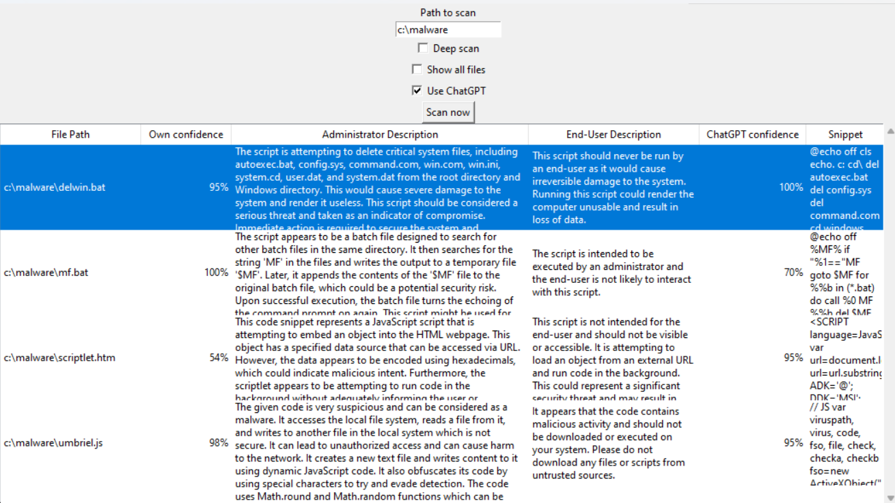

# GPT Virus Scanner

## What is this?

The GPT Virus Scanner uses AI to find malicious code in script files. It works in two stages:
1.  **Local Scan:** A fast, built-in model checks your files locally.
2.  **AI Analysis:** If a file looks suspicious, the tool sends a code snippet to an AI service (like OpenAI) for a detailed assessment.

**Note:** This tool is a prototype, not a commercial antivirus product. It scans scripts (such as Python, JavaScript, and Batch files) but does not analyze compiled programs or compressed files (like .zip).

## Quick Start

### Use the Windowed App (GUI)
1. Start the scanner: `python gptscan.py`
2. Choose a folder to scan.
3. Click **Scan now**.

### Use the Terminal (CLI)
Scan a folder and generate a JSON report:
```bash
python gptscan.py ./my_scripts --cli --json
```

## Requirements

*   **Python 3.9, 3.10, or 3.11** is required. Newer versions (like 3.12) are currently not compatible.
*   **TensorFlow** (version 2.15 or older) for local scanning.
*   **AI Service** (Optional, for detailed analysis):
    *   **OpenAI** or **OpenRouter** (requires an API key).
    *   **Ollama** (runs locally; no API key needed).
*   **Tkinter** for the graphical interface.

## Installation

1.  **Download the tool:**
    Clone this repository or download the files. Ensure `gptscan.py`, `scripts.h5`, and `task.txt` are in the same folder.

2.  **Install Python:** Download it from [python.org](https://www.python.org/). Choose version 3.9, 3.10, or 3.11.

3.  **Install required libraries:**
    Open your terminal or command prompt and run:
    ```bash
    pip install "tensorflow<2.16" openai
    ```
    *Linux users:* You may also need to install Tkinter:
    ```bash
    sudo apt-get install python3-tk
    ```

4.  **Set up your AI Service (Optional):**

    If you want to use **AI Analysis** (OpenAI or OpenRouter), you need an API key:
    *   Create a file named `apikey.txt` in the same folder as `gptscan.py`.
    *   Paste your API key into that file. It should contain only the key on a single line.
    *   **Alternatively:** Use the `OPENAI_API_KEY` or `OPENROUTER_API_KEY` environment variable.

    *   **OpenAI:** Get a key from [OpenAI](https://platform.openai.com/).
    *   **OpenRouter:** Get a key from [OpenRouter](https://openrouter.ai/).
    *   **Ollama:** Download [Ollama](https://ollama.com/) and ensure it is running. You must also download a model to use it (for example, run `ollama pull llama3.2` in your terminal).

    *Privacy Note:* Your code is only sent to the AI service if you enable the "Use AI Analysis" option. Check your provider's data policy.

## Configuration

You can customize the scanner using these optional files in the same folder:

*   **`apikey.txt`**: Your API key for OpenAI or OpenRouter.
*   **`extensions.txt`**: A list of file extensions to scan (e.g., `.py`, one per line). If missing, the tool defaults to `.py`, `.js`, `.bat`, and `.ps1`.
*   **`.gptscanignore`**: Patterns of files or folders to skip (like a `.gitignore` file).
*   **`task.txt`**: The instructions given to the AI for its analysis.

## How to Use

### Using the App Window

Run the script to open the window:
```bash
python gptscan.py
```

*   **Select Directory:** Choose the folder you want to scan.
*   **Deep Scan:** Scan every part of the file. By default, the tool only checks the beginning and end (the first and last 1,024 bytes) to save time.
*   **Show all files:** List every file scanned, even the safe ones.
*   **Use AI Analysis:** Get a detailed report for suspicious files.
*   **AI Analysis Settings:** Choose your service (OpenAI, OpenRouter, or Ollama) and the model you want to use.
*   **Import/Export Results:** Save your results to CSV, JSON, HTML, SARIF, or Markdown files, or load them back later.

You can sort the results by clicking the column headers.



### Using the Command Line (CLI)

Run scans from your terminal for automated tasks. Use the `--cli` flag.

**Examples:**
```bash
# Basic scan with AI analysis
python gptscan.py ./my_scripts --cli --use-gpt

# Scan using Ollama (local AI)
python gptscan.py ./my_scripts --cli --use-gpt --provider ollama --model llama3.2

# Export results to a JSON file
python gptscan.py ./my_scripts --cli --json --exclude "tests/*"
```

**Common Options:**
*   `--cli`: Run in command-line mode (required for terminal use).
*   `[target]`: The folder or file to scan.
*   `--path [path]`: An alternative way to specify the scan target.
*   `--deep`: Scan the entire file instead of just the beginning and end.
*   `--show-all`: List all files, even safe ones.
*   `--use-gpt`: Enable AI Analysis for suspicious code.
*   `--json`: Output results in JSON format (one object per line).
*   `--sarif`: Save results in SARIF format (standard for security tools).
*   `--html`: Create a standalone HTML report.
*   `--md, --markdown`: Create a Markdown report of the results.
*   `--dry-run`: List files that would be scanned without analyzing them.
*   `--extensions "py,js,bat"`: Scan specific file types (separated by commas).
*   `--exclude [patterns]`: Skip files matching these patterns (e.g., `node_modules/*`).
*   `--file-list [file]`: Read a list of files to scan from a text file.
*   `--git-changes`: Only scan files that have changed in your git repository.
*   `--provider [name]`: Choose your AI service ('openai', 'openrouter', or 'ollama').
*   `--model [name]`: Specify the exact AI model (e.g., 'gpt-4o', 'llama3.2').
*   `--api-base [url]`: Set a custom URL for the AI service (useful for local servers).
*   `--rate-limit [n]`: Limit AI requests per minute to avoid errors (default: 60).
*   `--fail-threshold [0-100]`: Return a failure code if any file meets this threat level.
*   `--version`: Show the tool's version.

## Troubleshooting

*   **Tkinter not found (Linux):** If you see a "ModuleNotFoundError: No module named 'tkinter'" error, install it using: `sudo apt-get install python3-tk`.
*   **Model file missing:** Make sure `scripts.h5` is in the same folder as `gptscan.py`. This file is required for the local scan.
*   **API key missing:** You can still use the local scan and Ollama without a key. For OpenAI or OpenRouter, add your key to `apikey.txt`.

## Contributing

We welcome your help!

*   **Reporting issues:** Let us know if the tool misses something or gives a false alarm.
*   **Submitting code:** Pull requests are welcome. Please run tests before submitting:
    ```bash
    pip install pytest pytest-asyncio pytest-mock pytest-cov
    python -m pytest --cov
    ```

## Credits

Thanks to the Stack Overflow community for GUI inspiration.

## License

LGPL 2.1 or later
