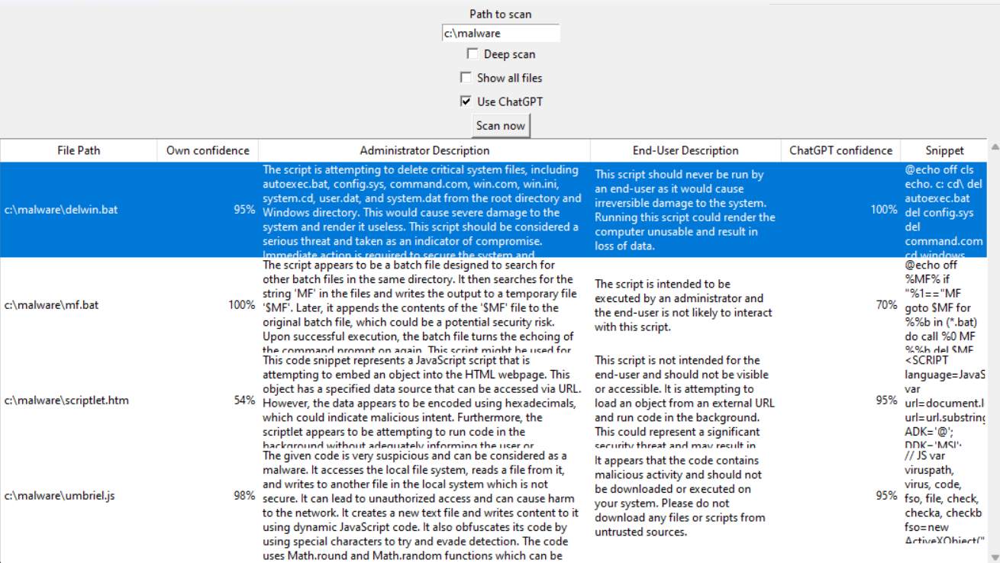

# GPT Virus Scanner

Scan your files for dangerous code with AI. This tool uses a quick scan model to find threats in scripts, Notebooks, archives, and project files.



## Features

### Core Capabilities
*   **Two-step analysis:**
    1.  **Fast Local Scan:** A quick check finds suspicious patterns in milliseconds.
    2.  **AI Analysis (Optional):** Get a detailed report from OpenAI, OpenRouter, or Ollama explaining why a file is suspicious.
*   **Flexible Interface:** Use the friendly window interface or the command line for automation.
*   **Git Integration:** Scan only the files you have changed in your project.
*   **Search & Filter:** Easily find specific results by name, threat level, or code.

### Supported Sources
*   **Scan Local & Web Files:** Scan files on your computer or directly from a web link.
*   **Remote Repositories:** Scan code from GitHub (including Gists), GitLab, and Bitbucket (including Snippets, pull requests, Commits, and Tags).
*   **Web Snippets:** Scan from Pastebin and Hugging Face.

### File Format Support
*   **Notebook Support:** Scan cells in `.ipynb` files for dangerous commands.
*   **Project & Build Files:** Scan `package.json`, `composer.json`, `pyproject.toml`, `deno.json`, `deno.jsonc`, `Dockerfile`, `Makefile`, and Docker Compose.
*   **Archives:** Open `.zip`, `.tar`, and `.tar.gz` files automatically to scan the contents.
*   **Automation Tasks:** Scan GitHub Actions, GitLab CI, and other YAML workflows for suspicious commands.
*   **Web Files:** Scan HTML, SVG, and Markdown files for embedded scripts.
*   **Unified Diffs:** Scan `.diff` and `.patch` files to review code changes.
*   **Deceptive Content Detection:** Detect executables and scripts disguised as images or documents (e.g., a Windows `.exe` renamed to `.jpg`) using content signatures (magic bytes).

## Installation

### Prerequisites
*   **Python:** Install **Python 3.9, 3.10, 3.11, or 3.12**.
*   **Data files:** The repository already includes the `scripts.h5` model and `task.txt` instruction files. Keep these in the project folder.

### Setup
1.  **Clone the repository:**
    ```bash
    git clone https://github.com/RainRat/gpt-virus-scanner.git
    cd gpt-virus-scanner
    ```
2.  **Create and activate a virtual environment (Recommended):**
    Using a virtual environment is highly recommended. It keeps your packages organized and avoids installation errors.

    *   **macOS and Linux:**
        ```bash
        python3 -m venv venv
        source venv/bin/activate
        ```
    *   **Windows (Command Prompt):**
        ```cmd
        python -m venv venv
        venv\Scripts\activate.bat
        ```
    *   **Windows (PowerShell):**
        ```powershell
        python -m venv venv
        .\venv\Scripts\Activate.ps1
        ```

    *Note: Remember to run the activation command whenever you open a new terminal. To exit the virtual environment when you are done, run the command `deactivate`.*

3.  **Install mandatory packages:**
    Choose the command based on your operating system and Python version.

    *   **macOS and Linux:**
        *   **For Python 3.9, 3.10, or 3.11:**
            ```bash
            python3 -m pip install "tensorflow<2.16" openai numpy
            ```
        *   **For Python 3.12:**
            ```bash
            python3 -m pip install tensorflow openai numpy
            ```
    *   **Windows:**
        *   **For Python 3.9, 3.10, or 3.11:**
            ```cmd
            python -m pip install "tensorflow<2.16" openai numpy
            ```
        *   **For Python 3.12:**
            ```cmd
            python -m pip install tensorflow openai numpy
            ```

4.  **Install optional packages (if needed):**
    *   **Tkinter (for the window interface on Linux):**
        On Windows and macOS, the window interface works automatically. On Linux, you must install the Tkinter package using your system's package manager. Do not use `pip` to install it.
        *   **Ubuntu / Debian:**
            ```bash
            sudo apt update
            sudo apt install python3-tk
            ```
        *   **Fedora:**
            ```bash
            sudo dnf install python3-tkinter
            ```
        *   **Arch Linux:**
            ```bash
            sudo pacman -S tk
            ```
    *   **PyYAML (for training models and YAML reports):**
        If you want to train your own local scanner models or export/import YAML reports, install PyYAML using pip:

        *   **macOS and Linux:**
            ```bash
            python3 -m pip install pyyaml
            ```
        *   **Windows:**
            ```cmd
            python -m pip install pyyaml
            ```

## How to use
### Using the Window (GUI)
Open the scanner window by running the appropriate command for your operating system:

*   **macOS and Linux:**
    ```bash
    python3 gptscan.py
    ```
*   **Windows:**
    ```cmd
    python gptscan.py
    ```

Access these options from the **Browse** menu:
#### Common Scans
*   **Scan File(s)... (Ctrl+Shift+O):** Select specific files to scan.
*   **Scan Folder... (Ctrl+Shift+F):** Select an entire folder to scan.
*   **Scan Recently Modified...:** Scan files changed within a certain time (like the last 24 hours).
*   **Scan Web Link... (Ctrl+Shift+U):** Scan code or archives directly from a web link.
*   **Scan File List...:** Scan a list of files from a text file.
*   **Scan Clipboard (Ctrl+Shift+V):** Scan code you have copied to your clipboard.

#### Git Integration
*   **Scan Git Diff (Ctrl+Shift+D):** Scan your current project changes as a diff.
*   **Scan Recent Commits...:** Scan files from the most recent commits.
*   **Scan Git Hooks (Ctrl+Shift+G):** Scan your local and global Git hooks for suspicious scripts.
*   **Scan Git Stashes (Ctrl+Shift+Q):** Scan all Git stashes for suspicious code changes.
*   **Scan Git Conflicts:** Scan files with Git merge conflicts for suspicious code introduced during merging.
*   **Scan Git Configuration:** Scan Git settings for dangerous aliases or editors.
*   **Scan Git Reflog...:** Scan recent entries in your Git reflog to find lost code or secrets.
*   **Scan Git Revision...:** Scan files from a specific Git branch or commit.

#### System Scans
*   **Scan System Audit (Ctrl+Shift+I):** Run a full check of your system, including all items listed below.
*   **Scan Shell Profiles (Ctrl+Shift+B):** Scan your shell configuration files (like `.bashrc` or `.zshrc`) for dangerous aliases.
*   **Scan Shell History (Ctrl+Shift+H):** Scan your terminal history for dangerous commands.
*   **Scan System PATH (Ctrl+Shift+P):** Scan folders in your system PATH for suspicious programs.
*   **Scan Running Processes (Ctrl+Shift+K):** Scan the command lines of active processes.
*   **Scan Environment Variables (Ctrl+Shift+N):** Scan your environment variables for suspicious scripts.
*   **Scan Env Files:** Scan all common .env files found in home and current directories.
*   **Scan Scheduled Tasks (Ctrl+Shift+T):** Scan tasks and Cron jobs for ways programs stay on your system.
*   **Scan Startup Items (Ctrl+Shift+A):** Scan startup items and LaunchAgents.
*   **Scan System Services (Ctrl+Shift+S):** Scan system services and background units.
*   **Scan SSH Configuration:** Scan all common SSH configuration and authorized_keys files.
*   **Scan Network Configuration:** Scan all common network configuration files (hosts, resolv.conf, etc.).
*   **Scan Python Packages (Ctrl+Shift+Y):** Scan your installed Python packages for malicious code.
*   **Scan Node.js Packages (Ctrl+Shift+M):** Scan your global Node.js packages.
*   **Scan Ruby Gems:** Scan all folders containing installed Ruby gems.
*   **Scan PHP Packages:** Scan all folders containing global PHP Composer packages.
*   **Scan Rust Packages:** Scan all folders containing global Rust Cargo packages.
*   **Scan Go Packages:** Scan all folders containing Go packages.
*   **Scan Java Packages:** Scan all folders containing Java package caches (Maven and Gradle).
*   **Scan .NET Packages:** Scan all folders containing global .NET NuGet package caches.
*   **Scan Browser Bookmarks:** Scan all common browser bookmark files for suspicious bookmarklets (javascript: or data: URLs).
*   **Scan Browser Extensions (Ctrl+Shift+W):** Scan your browser extension folders for malicious scripts.
*   **Scan Editor Extensions (Ctrl+Shift+X):** Scan extensions for VS Code, Sublime Text, and Vim.
*   **Scan Documents:** Scan your standard Documents folder for suspicious files.
*   **Scan Downloads (Ctrl+Shift+J):** Scan your standard Downloads folder for suspicious files.
*   **Scan Desktop (Ctrl+Shift+L):** Scan your standard Desktop folder for suspicious files.
*   **Scan Temporary Folders (Ctrl+Shift+Z):** Scan common temporary folders for suspicious files.


### Keyboard Shortcuts
The scanner includes shortcuts for faster navigation.

*Note: macOS users should use `Command` instead of `Ctrl` for most shortcuts.*

| Shortcut | Action |
| :--- | :--- |
| **General** | |
| `Enter` | Start Scan |
| `Esc` | Cancel Scan |
| `Ctrl+F` | Focus Filter Bar |
| `Ctrl+O` | Import Results |
| `Ctrl+E` | Export Results |
| `Ctrl+V` | Import Results from Clipboard |
| `Ctrl+Shift+E` | Copy as Command Line |
| `Ctrl+Shift+Delete` | Clear Results |
| **Scan Actions** | |
| `Ctrl+Shift+O` | Scan File(s) |
| `Ctrl+Shift+F` | Scan Folder |
| `Ctrl+Shift+U` | Scan Web Link |
| `Ctrl+Shift+V` | Scan Clipboard |
| `Ctrl+Shift+D` | Scan Git Diff |
| `Ctrl+Shift+G` | Scan Git Hooks |
| `Ctrl+Shift+Q` | Scan Git Stashes |
| `Ctrl+Shift+B` | Scan Shell Profiles |
| `Ctrl+Shift+I` | Scan System Audit |
| `Ctrl+Shift+H` | Scan Shell History |
| `Ctrl+Shift+P` | Scan System PATH |
| `Ctrl+Shift+K` | Scan Running Processes |
| `Ctrl+Shift+N` | Scan Environment Variables |
| `Ctrl+Shift+T` | Scan Scheduled Tasks |
| `Ctrl+Shift+A` | Scan Startup Items |
| `Ctrl+Shift+S` | Scan System Services |
| `Ctrl+Shift+Y` | Scan Python Packages |
| `Ctrl+Shift+M` | Scan Node.js Packages |
| `Ctrl+Shift+W` | Scan Browser Extensions |
| `Ctrl+Shift+X` | Scan Editor Extensions |
| `Ctrl+Shift+J` | Scan Downloads |
| `Ctrl+Shift+L` | Scan Desktop |
| `Ctrl+Shift+Z` | Scan Temporary Folders |
| **Results List** | |
| `Space` / `Enter` | View Details |
| `F5` / `r` | Rescan |
| `Delete` | Exclude |
| `Ctrl+A` | Select All |
| `Ctrl+C` | Copy File Path |
| `Ctrl+Shift+C` | Copy as Markdown Table |
| `Ctrl+H` | Copy SHA-256 Hash |
| `Ctrl+S` | Copy Code Snippet |
| `Ctrl+J` | Copy Results as JSON |
| `Ctrl+G` | Analyze Selected with AI |
| `Ctrl+Shift+R` | Copy as Triage Report |
| `Shift+Enter` | Open File |
| `Ctrl+Enter` | Reveal in Folder |
| `Ctrl+T` | Check on VirusTotal |
| `Ctrl+L` | View Online |
| **Details Window** | |
| `Esc` | Close Window |
| `Left` / `Right` | Previous / Next Result |
| `Alt+Left` / `Alt+Right` | Force Previous / Next Result |
| `Alt+Up` / `Alt+Down` | Force Previous / Next Result |
| `Ctrl+PageUp` / `Ctrl+PageDown` | Force Previous / Next Result |
| `F5` / `r` | Rescan |
| `Delete` | Exclude |
| `Ctrl+U` | Toggle Full Source |
| `Ctrl++` / `Ctrl+-` | Zoom In / Out Code Viewer |
| `Ctrl+0` | Reset Code Viewer Zoom |
| `Ctrl+S` | Copy Code Snippet |
| `Ctrl+Shift+C` | Copy AI Analysis |
| `Ctrl+H` | Copy SHA-256 Hash |
| `Ctrl+J` | Copy JSON Data |
| `Ctrl+Shift+R` | Copy as Triage Report |
| `Ctrl+T` | Check on VirusTotal |
| `Ctrl+L` | View Online |
| `Shift+Enter` | Open File |
| `Ctrl+Enter` | Reveal in Folder |

### Using the Terminal (CLI)
To run the scanner in your terminal, use the `--cli` flag.

*Note: If you are on Windows, use `python` instead of `python3` for all the terminal examples shown below.*

#### Basic Usage
Scan a single file or folder:
```bash
python3 gptscan.py path/to/your/script.py --cli
```

Scan multiple files, folders, or web links:
```bash
python3 gptscan.py file1.py folder/ https://github.com/user/repo --cli
```

Scan files modified in the last 24 hours:
```bash
python3 gptscan.py --modified 24h --cli
```

#### System Scans
Perform a comprehensive system audit:
```bash
python3 gptscan.py --audit --cli
```

Scan all folders containing installed Python packages:
```bash
python3 gptscan.py --python-packages --cli
```

Scan all folders containing global Node.js packages:
```bash
python3 gptscan.py --nodejs-packages --cli
```

Scan all folders containing installed Ruby gems:
```bash
python3 gptscan.py --ruby-gems --cli
```

Scan all folders containing global PHP Composer packages:
```bash
python3 gptscan.py --php-packages --cli
```

Scan all folders containing global Rust Cargo packages:
```bash
python3 gptscan.py --rust-packages --cli
```

Scan all folders containing Go packages:
```bash
python3 gptscan.py --go-packages --cli
```

Scan all folders containing Java package caches (Maven and Gradle):
```bash
python3 gptscan.py --java-packages --cli
```

Scan all folders containing global .NET NuGet package caches:
```bash
python3 gptscan.py --dotnet-packages --cli
```

Scan all common browser bookmark files for suspicious bookmarklets:
```bash
python3 gptscan.py --browser-bookmarks --cli
```

Scan all common browser extension folders:
```bash
python3 gptscan.py --browser-extensions --cli
```

Scan all folders containing editor extensions:
```bash
python3 gptscan.py --editor-extensions --cli
```

Scan all common shell profile and configuration files (like .bashrc or .zshrc):
```bash
python3 gptscan.py --shell-profiles --cli
```

Scan the standard Downloads folder:
```bash
python3 gptscan.py --downloads --cli
```

Scan the standard Desktop folder:
```bash
python3 gptscan.py --desktop --cli
```

Scan your terminal history (Bash, Zsh, PowerShell, etc.):
```bash
python3 gptscan.py --shell-history --cli
```

Scan all folders in your system PATH:
```bash
python3 gptscan.py --system-path --cli
```

Scan command lines of all running processes:
```bash
python3 gptscan.py --running-processes --cli
```

Scan all scheduled tasks and Cron jobs:
```bash
python3 gptscan.py --scheduled-tasks --cli
```

Scan all system startup items and LaunchAgents:
```bash
python3 gptscan.py --startup-items --cli
```

Scan all system services:
```bash
python3 gptscan.py --system-services --cli
```

Scan SSH configuration and authorized keys:
```bash
python3 gptscan.py --ssh-config --cli
```

Scan all common network configuration files:
```bash
python3 gptscan.py --network-config --cli
```

Scan your standard Documents folder:
```bash
python3 gptscan.py --documents --cli
```

Scan common temporary folders:
```bash
python3 gptscan.py --temp --cli
```

Scan all environment variables:
```bash
python3 gptscan.py --env-vars --cli
```

Scan all common .env files:
```bash
python3 gptscan.py --env-files --cli
```

#### Git Integration
Scan changes in your local project as a diff:
```bash
python3 gptscan.py --git-diff --cli
```

Scan local and global Git hooks for dangerous scripts:
```bash
python3 gptscan.py --git-hooks --cli
```

Scan potentially dangerous Git configuration settings:
```bash
python3 gptscan.py --git-config --cli
```

Scan all Git stashes:
```bash
python3 gptscan.py --git-stash --cli
```

Scan all files with Git merge conflicts:
```bash
python3 gptscan.py --git-conflicts --cli
```

Scan recent entries in the Git reflog:
```bash
python3 gptscan.py --git-reflog 5 --cli
```

Scan files changed in your project:
```bash
python3 gptscan.py --git-changes --cli
```

Scan the last 5 Git commits:
```bash
python3 gptscan.py --git-history --cli
```

#### Advanced Scans
Scan code sent from another command in the terminal:
```bash
echo "import os; os.system('rm -rf /')" | python3 gptscan.py --stdin --cli
```

Filter out known findings using a previous scan report as a baseline:
```bash
python3 gptscan.py ./my_project --baseline previous_report.json --cli
```

Save scan results to a file (CSV, JSON, HTML, etc.):
```bash
python3 gptscan.py ./my_project --output results.html --cli
```

#### Output Formats
By default, the scanner prints human-readable text to the terminal. You can customize the output format with these flags:
*   `--json`: Print or save results in JSON format.
*   `--csv`: Print or save results in CSV format.
*   `--sarif`: Save results in SARIF format (useful for security scanning tools).
*   `--html`: Create an interactive HTML report.
*   `--md` / `--markdown`: Create a Markdown report.
*   `--xml`: Create an XML report.
*   `--yaml` / `--yml`: Create a YAML report (requires the `pyyaml` package).
*   `--report`: Output a detailed triage report to the terminal.

To save the formatted output directly to a file, combine any format flag with the `--output` (or `-o`) option:
```bash
python3 gptscan.py ./my_project --json --output results.json --cli
```

To limit output to the top N highest-risk findings, use `--top` (or `--limit`):
```bash
python3 gptscan.py ./my_project --top 10 --report --cli
```

#### CI/CD & Exit Codes
You can use the scanner in CI/CD pipelines (like GitHub Actions) to prevent malicious or dangerous code from being committed.

Use the `--fail-threshold` option followed by a threat level (0 to 100) to fail the scan. If any scanned file meets or exceeds this threat level, the script will exit with code `1`, stopping your build or pipeline:
```bash
# Fail the build if any file has a threat level of 70 or higher
python3 gptscan.py ./my_project --cli --fail-threshold 70
```

#### CLI Options Reference
You can customize terminal scans using these command line options.

##### Scan Options
*   `target` (or other arguments): The folder, file, pattern, or web link to scan.
*   `-p`, `--path <path>`: Alternative way to specify a folder, file, or web link to scan.
*   `-d`, `--deep`: Scan the whole file instead of just the beginning and end. This is more thorough but slower.
*   `--dry-run`: Preview which files would be scanned without actually checking them.
*   `--extensions <exts>`: Only scan these file types (for example: `py,js`).
*   `-e`, `--exclude <patterns>`: Ignore files or folders matching these patterns (for example: `node_modules/*`).
*   `--exclude-file <file>`: Read a list of exclude patterns from a file.
*   `--file-list <file>`: Read a list of files to scan from a text file.
*   `--all-files`: Scan every file, even if it is not a script.
*   `--fail-threshold <num>`: Exit with code `1` if any file has a threat level at or above this number (0-100).
*   `-t`, `--threshold <num>`: Set the minimum threat level (0-100) to show in results (default is 50).
*   `--stdin`: Scan code piped from another command.
*   `-c`, `--clipboard`: Scan code currently copied in the system clipboard.
*   `--import-results <file>` / `--import <file>`: Import results from a previous scan. Use `-` to read from the terminal.
*   `--baseline <file>`: A previous scan report (in any supported format) to act as a baseline. Findings matching this baseline are filtered out.
*   `--max-size <size>`: The maximum file size to scan (for example: `10MB`). Default is 10MB.
*   `--modified <time>`: Only scan files changed within this time (for example: `24h`, `1h`, `7d`).
*   `--downloads`: Scan the standard Downloads folder.
*   `--desktop`: Scan your standard Desktop folder.

##### Git Integration
*   `--git-changes [<commit>]`: Only scan files changed in Git. You can optionally provide a branch or commit (default is `HEAD`).
*   `--git-diff [<commit>]`: Scan current Git changes as a diff. You can optionally provide a branch or commit (default is `HEAD`).
*   `--git-hooks`: Scan local and global Git hooks.
*   `--git-config`: Scan for dangerous Git configuration settings.
*   `--git-stash`: Scan all Git stashes.
*   `--git-conflicts`: Scan files with Git merge conflicts.
*   `--git-history [<count>]`: Scan recent Git commits. You can optionally set the number of commits (default is 5).
*   `--git-reflog [<count>]`: Scan recent entries in your Git reflog. You can optionally set the number of entries (default is 5).

##### System Scans
*   `--audit`: Run a complete system audit (includes shell profiles, history, system PATH, processes, scheduled tasks, startup items, system services, and more).
*   `--shell-profiles`: Scan common shell profile and configuration files (like `.bashrc` or `.zshrc`).
*   `--shell-history`: Scan common shell history files for dangerous commands.
*   `--system-path`: Scan all folders in the system PATH.
*   `--running-processes`: Scan command lines of all active processes.
*   `--scheduled-tasks`: Scan all scheduled tasks and Cron jobs.
*   `--startup-items`: Scan all system startup items and LaunchAgents.
*   `--system-services`: Scan all system services and background units.
*   `--python-packages`: Scan all folders containing installed Python packages.
*   `--browser-bookmarks`: Scan all common browser bookmark files for suspicious bookmarklets.
*   `--nodejs-packages`: Scan all folders containing global Node.js packages.
*   `--browser-extensions`: Scan all common browser extension folders.
*   `--editor-extensions`: Scan all common editor extension folders.
*   `--ssh-config`: Scan all common SSH configuration and authorized_keys files.
*   `--network-config`: Scan all common network configuration files (like `hosts` or `resolv.conf`).
*   `--env-vars`: Scan all non-empty environment variables.
*   `--env-files`: Scan all common `.env` files.
*   `--ruby-gems`: Scan all folders containing installed Ruby gems.
*   `--php-packages`: Scan all folders containing global PHP Composer packages.
*   `--rust-packages`: Scan all folders containing global Rust Cargo packages.
*   `--go-packages`: Scan all folders containing Go packages.
*   `--java-packages`: Scan all folders containing Java package caches (Maven and Gradle).
*   `--dotnet-packages`: Scan all folders containing global .NET NuGet package caches.
*   `--documents`: Scan your standard Documents folder.
*   `--temp`: Scan common temporary folders.

##### AI Analysis
*   `-g`, `--use-gpt`: Use AI to analyze suspicious files. Cloud providers require an API key; Ollama does not.
*   `--provider <name>`: Choose your AI service (`openai`, `openrouter`, or `ollama`). Default is `openai`.
*   `--model <model>`: Choose the AI model to use (for example: `gpt-4o`, `llama3.2`).
*   `-k`, `--api-key <key>`: Provide the API key for your AI service.
*   `--api-base <url>`: Set a custom web link for the AI service endpoint (useful for local servers).
*   `--rate-limit <num>`: Set the maximum AI requests allowed per minute (default is 60).
*   `--clear-cache`: Clear the AI analysis cache before starting the scan.

##### Output Options
*   `--cli`: Run in the terminal instead of opening a GUI window.
*   `-q`, `--quiet`: Suppress progress updates and summary banners in terminal output.
*   `-a`, `--show-all`: Show all scanned files, even safe ones (threat level under threshold).
*   `-o`, `--output <file>`: Save the scan results to a file.
*   `-j`, `--json`: Output or save results in JSON format.
*   `--csv`: Output or save results in CSV format.
*   `--sarif`: Save results in SARIF format.
*   `--html`: Create an interactive HTML report.
*   `--md`, `--markdown`: Create a Markdown report.
*   `--xml`: Create an XML report.
*   `--yaml`, `--yml`: Create a YAML report.
*   `--report`: Output a detailed triage report to the terminal.
*   `--top <N>` / `--limit <N>`: Limit output results to the top N highest-risk findings.

### Setting up AI Analysis
To use AI analysis, you need an API key for OpenAI or OpenRouter, or have Ollama running locally.

#### API Keys
You can provide your API key in four ways:
*   **In the GUI:** Enter it in the **AI Analysis** panel. It will be saved locally to `apikey.txt`.
*   **Environment Variables:** Set the `OPENAI_API_KEY` or `OPENROUTER_API_KEY` environment variable in your terminal.

    Here is how to set it for different terminals:
    *   **macOS / Linux (Bash or Zsh):**
        ```bash
        export OPENAI_API_KEY="your-api-key-here"
        ```
    *   **Windows (Command Prompt):**
        ```cmd
        set OPENAI_API_KEY=your-api-key-here
        ```
    *   **Windows (PowerShell):**
        ```powershell
        $env:OPENAI_API_KEY="your-api-key-here"
        ```
*   **Local File:** Create a file named `apikey.txt` in the project folder and paste your key there.
*   **Command Line:** Pass your key directly with the `--api-key` (or `-k`) option in your terminal scan.

*Note: Do not share `apikey.txt` or commit it to a public repository.*

#### Local AI Analysis (Ollama)
You can analyze files locally for free without sharing your data over the internet. To do this, use Ollama on your computer.

1.  **Download Ollama:**
    Download and install Ollama from [ollama.com](https://ollama.com).
2.  **Download a model:**
    Open your terminal and download the default model by running:
    ```bash
    ollama run llama3.2
    ```
    *Note: You can use other models like `llama3` or `mistral` by running `ollama run <model-name>`.*
3.  **Run the scanner with Ollama:**
    *   **In the GUI:** Select **ollama** from the **AI Provider** dropdown list. You can leave the API key blank.
    *   **In the CLI:** Use the `--provider ollama` flag:
        ```bash
        python3 gptscan.py ./my_project --cli --use-gpt --provider ollama
        ```

#### Custom API Base (Advanced)
If you use a local proxy or a custom endpoint (like a specific Ollama setup or an OpenAI-compatible server), you can set a custom **API Base** web link in the GUI or with the `--api-base` terminal flag.

## Reviewing Results
The scanner provides several ways to analyze and manage your results:
*   **Filtering Results:**
    *   **Filter Bar:** Use the **Filter** bar at the top (or press `Ctrl+F`) to quickly find results by file path, analysis text, or code snippets.
    *   **Min. Threat Level:** Use the **Min. Threat Level** setting in the **Filter** bar to hide files with low threat scores.
*   **View Details:** Double-click any result or press `Space` to see a detailed analysis and the full source code.
*   **Right-Click Menu:** Right-click a result for quick actions:
    *   **Rescan:** Scan the file again (useful after making changes).
    *   **Exclude:** Add the file or folder to your ignore list.
    *   **Check on VirusTotal:** Search for the file's hash on VirusTotal.
    *   **View Online:** Open the source file in your web browser (for Git projects and remote web links).
*   **Export & Import:**
    *   **Export Results:** Save your scan to a file (CSV, Markdown, HTML, JSON, SARIF, XML, or YAML) via **File > Export Results...**.
    *   **Import Results:** Load previous scan results from any of the supported formats via **File > Import Results...** or by pasting them from your clipboard (`Ctrl+V`).

## Customizing the Scanner
You can tailor the scanner to your needs:
*   **Git Changes Only:** Only scan files that have been modified or are untracked in Git. Use the **Git changes only** checkbox or the `--git-changes` flag.
*   **Exclusions:** Ignore specific files or folders by using **File > Manage Exclusions...** or by adding patterns to a `.gptscanignore` file. In the terminal, use the `-e` or `--exclude` flag, or provide a pattern file using `--exclude-file`.
*   **Extensions:** Control which file types are scanned by using **File > Manage Extensions...** or by editing the `extensions.txt` file. In the terminal, use the `--extensions` flag.
*   **File Size:** The scanner skips files larger than 10MB during folder scans. You can adjust this limit in the **Scan Options** panel or by using the `--max-size` flag. Files you select individually are always scanned, regardless of their size.
*   **Deep Scan:** Scan the entire file instead of just the beginning and end. This is more thorough but slower. Use the **Deep Scan** checkbox or the `-d` or `--deep` flag.
*   **Scan All Files:** By default, the scanner only checks script-like files (like `.py` or `.js`). Use the **Scan All Files** checkbox or the `--all-files` flag to check every file.
*   **Dry Run:** Preview which files would be scanned without actually checking them. Use the **Dry Run** checkbox or the `--dry-run` flag.

## Advanced Usage
### Training the Model
You can train the local "quick scan" model on your own data. This requires `pyyaml` to be installed.
See [Training the Local Scanner](train.md) for more information.

### Running Tests
If you want to contribute to the project or run the test suite, you can install the test dependencies and run the tests.

#### 1. Install test packages
Install the required testing packages by running the appropriate command:

*   **macOS and Linux:**
    ```bash
    python3 -m pip install pytest pytest-asyncio pytest-mock pytest-cov Pillow pyyaml
    ```
*   **Windows:**
    ```cmd
    python -m pip install pytest pytest-asyncio pytest-mock pytest-cov Pillow pyyaml
    ```

#### 2. Run the full test suite
To run all tests, run:
```bash
python3 -m pytest
```

If you are using Python 3.12, some training tests might fail due to TensorFlow library compatibility. In Python 3.12, you can ignore the training tests with this command:
```bash
python3 -m pytest --ignore=tests/test_train.py
```

## How it works
1.  **Local Filter:** The tool uses a quick scan model trained on thousands of safe and dangerous scripts. It looks for patterns like hidden code and suspicious commands.
2.  **AI Analysis:** If a file looks suspicious, you can ask an AI for a second opinion. The AI will explain *why* it thinks the code is dangerous, helping you decide what to do.

## Troubleshooting & FAQs

Here are solutions to common issues you might run into when installing or using the scanner.

### 1. "Externally Managed Environment" Error
* **The Issue:** Modern operating systems (like Debian 12+, Ubuntu 23.04+, and newer macOS versions) prevent installing packages globally with `pip` to avoid breaking system tools.
* **The Solution:** Always use a virtual environment! Follow the **Setup** steps in the Installation section to create and activate a virtual environment (`venv`) before running the install command.

### 2. Tkinter / GUI Does Not Open on Linux
* **The Issue:** Linux servers or headless desktop environments often do not have Tkinter installed by default, causing startup errors.
* **The Solution:**
  1. If you are on a server or don't need a window interface, run the scanner in terminal mode by adding the `--cli` flag:
     ```bash
     python3 gptscan.py ./my_project --cli
     ```
  2. If you want the window interface, install the Tkinter system package for your distribution (for example, `sudo apt install python3-tk` on Ubuntu/Debian).

### 3. TensorFlow Installation Errors
* **The Issue:** Installing TensorFlow can fail on certain systems or take a long time to compile.
* **The Solution:**
  * **macOS (M1/M2/M3 Apple Silicon):** Make sure you have Xcode Command Line Tools installed by running `xcode-select --install` in your terminal first. Then install tensorflow within your virtual environment.
  * **Windows:** If `pip` fails to compile a package, you may need the Microsoft C++ Build Tools. Download them from the official Microsoft site or use a pre-built binary wheel if available.

### 4. Setting up Alternative AI Providers (OpenRouter or Ollama)
* **The Issue:** You want to use a provider other than OpenAI, but you are not sure how to configure the environment.
* **The Solution:**
  * **OpenRouter:** Set the `OPENROUTER_API_KEY` environment variable in your terminal:
    * *macOS/Linux:* `export OPENROUTER_API_KEY="your-key"`
    * *Windows CMD:* `set OPENROUTER_API_KEY=your-key`
    * *PowerShell:* `$env:OPENROUTER_API_KEY="your-key"`
  * **Ollama (Local AI):** Run Ollama on your computer first, then start the scanner with `--provider ollama` and `--model llama3.2`. If you use a custom Ollama port or host, specify it with `--api-base http://your-custom-address:port/v1`.

### 5. Missing File Errors (e.g., scripts.h5 or task.txt not found)
* **The Issue:** The scanner complains that a critical data file is missing.
* **The Solution:** The scanner expects these files to be in the folder where the `gptscan.py` script resides. Make sure you do not delete `scripts.h5` or `task.txt`, and always run the command from the repository root directory.

## License
This project is licensed under the GNU Lesser General Public License v2.1.
